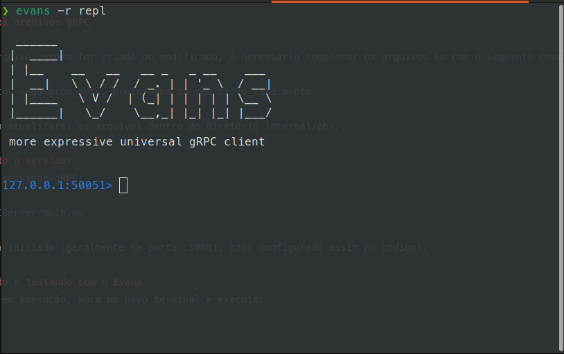
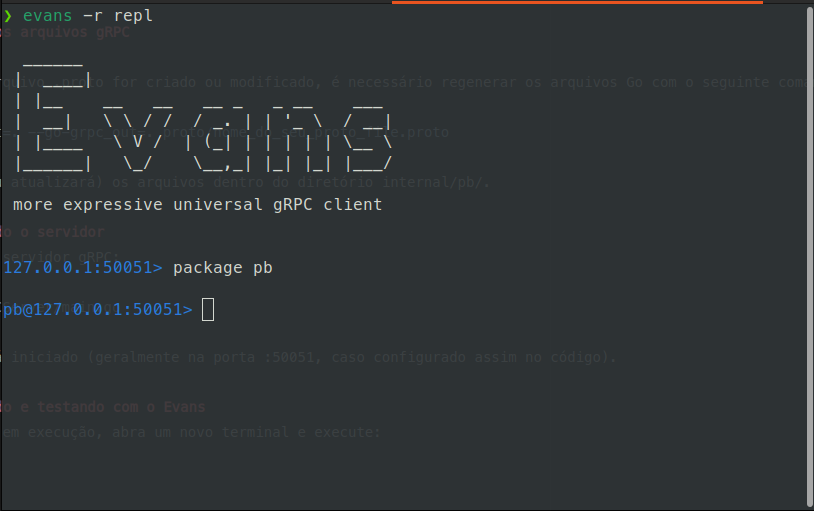
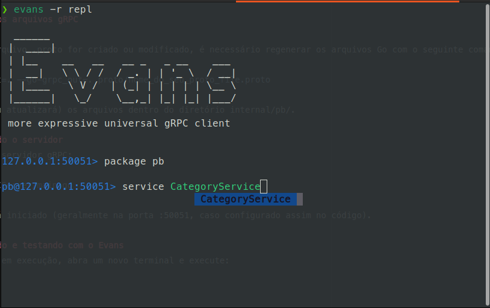
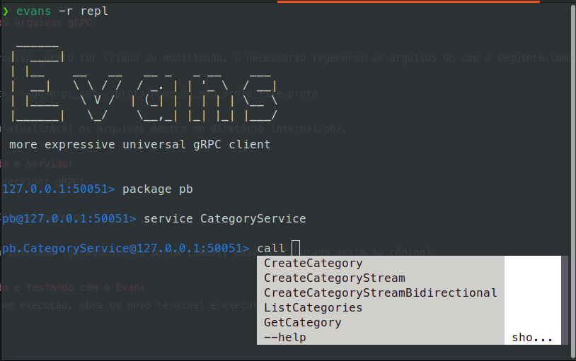

# 🧩 Projeto Go com gRPC

Este projeto é um exemplo de aplicação escrita em **Go** utilizando **gRPC** para comunicação entre cliente e servidor.


## 🚀 Pré-requisitos

Antes de começar, certifique-se de ter instalado:

- [Go](https://go.dev/dl/) (versão 1.21+ recomendada)
- [Protocol Buffers (protoc)](https://grpc.io/docs/protoc-installation/)
  ```bash
  linux
    sudo apt install -y protobuf-compiler
    protoc --version  # Ensure compiler version is 3+
  ```
- Plugins do Go para o protoc:
  ```bash
  go install google.golang.org/protobuf/cmd/protoc-gen-go@latest
  go install google.golang.org/grpc/cmd/protoc-gen-go-grpc@latest
  ```
- [Evans](https://github.com/ktr0731/evans)

⚙️ Após instalar os plugins do Go, garanta que o diretório de binários esteja no seu PATH
```bash
export PATH="$PATH:$(go env GOPATH)/bin"
```


## 🧠 Estrutura do projeto
```csharp
.
├── cmd/
│   └── gRPCServer/
│       └── main.go # Ponto de entrada do servidor
├── internal/
│   ├── database/
│   │   ├── category.go
│   │   └── course.go
│   ├── pb/
│   │   ├── course_category_grpc.pb.go
│   │   └── course_category.pb.go
│   └── service/
│       └── category.go
├── proto/
│   └── course_category.proto
├── db.sqlite  # Banco local
├── go.mod
├── go.sum
└── README.md 
```


## 🔨 Gerando os arquivos gRPC

Sempre que o arquivo .proto for criado ou modificado, é necessário rodar o seguinte comando:
```bash
protoc --go_out=. --go-grpc_out=. proto/nome_do_seu_proto_file.proto
```
Isso cria ou atualiza os arquivos dentro do diretório internal/pb/.


## ▶️ Executando o servidor
Para iniciar o servidor gRPC:
```bash
go run cmd/gRPCServer/main.go
```
O servidor será iniciado (geralmente na porta :50051, caso configurado assim no código).


## 💬 Utilizando e testando com o Evans
Com o servidor em execução, abra um novo terminal e execute:



Para acessar um **package**:



Para acessar o **service**:



Para testar algum método basta escrever **call** e escolher o método:



---

## 🏁 Conclusão

Este projeto demonstra o uso de gRPC com Go, servindo como base para estudos ou implementação de APIs eficientes e escaláveis.

Sinta-se à vontade para contribuir, abrir issues ou sugerir melhorias. 🚀